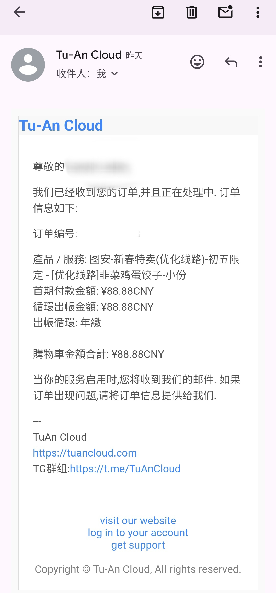

### 人生第一台小鸡「Tuan_云」
反正**这家跑了**，我还有六十多块钱的余额，说退款也没退，说开新机器，可是就此没了下文。
而且能用的时候也经常崩，我部署的 typecho 阵亡有不知道有多少次。




```
--------------------------------------------------------------------------------------

CPU Model            : Intel Xeon Processor (Skylake, IBRS)
CPU Cores            : 1 Cores 2499.998 MHz x86_64
CPU Cache            : 16384 KB
CPU Flags            : AES-NI Enabled & VM-x/AMD-V Enabled
OS                   : Debian GNU/Linux 11 (64 Bit) KVM
Kernel               : 5.10.0-20-amd64
Total Space          : 1.5 GB / 10.0 GB
Total RAM            : 117 MB / 940 MB (676 MB Buff)
Total SWAP           : 0 MB / 0 MB
Uptime               : 0 days 7 hour 59 min
Load Average         : 0.24, 0.06, 0.02
TCP CC               : cubic
ASN & ISP            : AS8796, Cogent Communications
Organization         : Kurun Cloud Inc
Location             : Los Angeles, United States / US
Region               : California
---------------------------------

Geekbench v4 CPU Benchmark:
Single Core    : 2542  (Good)
Multi Core    : 2480
--------------------

Streaming Media Unlock:
Netflix              : Originals Only
YouTube Premium      : Yes (Region: US)
YouTube CDN          : ->expr: syntax error: unexpected argument ‘2’
awk: line 1: syntax error at or near end of line
YouTube CDN          :
BiliBili China Only  : No
-------------------------

I/O Speed( 1.0GB )   : 995 MB/s
I/O Speed( 1.0GB )   : 1.3 GB/s
I/O Speed( 1.0GB )   : 1.3 GB/s
Average I/O Speed    : 1219.1 MB/s
----------------------------------

Node Name        Upload Speed      Download Speed      Latency
Speedtest.net    504.92 Mbit/s     453.43 Mbit/s       0.61 ms
Fast.com         0.00 Mbit/s       114.2 Mbit/s        -
Nanjing 5G   CT  9.34 Mbit/s       431.39 Mbit/s       166.97 ms
Shanghai 5G  CU  492.19 Mbit/s     442.40 Mbit/s       174.83 ms
--------------------------------------------------------------------------------------------------------------------------------------------------------------------------------------------------------------------------------------------------------------------------------------------------------------------

Node Name        Upload Speed      Download Speed      Latency
Hong Kong    CN  537.90 Mbit/s     466.22 Mbit/s       144.87 ms
Taiwan       CN  543.07 Mbit/s     459.66 Mbit/s       125.94 ms
Singapore    SG  532.60 Mbit/s     473.87 Mbit/s       170.30 ms
Tokyo        JP  374.49 Mbit/s     463.63 Mbit/s       99.16 ms
Frankfurt    DE  554.52 Mbit/s     439.72 Mbit/s       152.72 ms
---------------------------------------------------------------------------------------------------------------------------------------------------------------------------------------------------------------------------------------------------------------------------------------------------------------------------------------------------------------------------------------------

Traceroute to 上海电信 (Mode, Max 30 Hop)
=========================================

traceroute to 101.95.206.10 (101.95.206.10), 30 hops max, 32 byte packets
1  *
2  *
3  192.168.226.22  1.04 ms  *  局域网
4  219.158.42.41  166.05 ms  AS4837  美国, 加利福尼亚州, 洛杉矶, chinaunicom.com, 联通
5  219.158.96.29  182.66 ms  AS4837  中国, 广东, 广州, chinaunicom.com, 联通
6  219.158.4.41  177.64 ms  AS4837  中国, 广东, 广州, chinaunicom.com, 联通
7  219.158.3.21  180.79 ms  AS4837  中国, 广东, 广州, chinaunicom.com, 联通
8  219.158.6.233  178.75 ms  AS4837  中国, 上海, chinaunicom.com, 联通
9  *
10  *
11  *
12  101.95.88.93  175.43 ms  AS4812  中国, 上海, chinatelecom.com.cn, 电信
13  *
14  101.95.206.10  164.44 ms  AS4812  中国, 上海, chinatelecom.com.cn, 电信

Traceroute to 上海CN2 (Mode, Max 30 Hop)
========================================

traceroute to 58.32.0.1 (58.32.0.1), 30 hops max, 32 byte packets
1  *
2  *
3  192.168.226.20  0.68 ms  *  局域网
4  192.168.225.227  0.70 ms  *  局域网
5  219.158.42.41  177.80 ms  AS4837  美国, 加利福尼亚州, 洛杉矶, chinaunicom.com, 联通
6  219.158.97.205  170.12 ms  AS4837  中国, 广东, 广州, chinaunicom.com, 联通
7  219.158.4.1  168.83 ms  AS4837  中国, 广东, 广州, chinaunicom.com, 联通
8  219.158.3.33  168.08 ms  AS4837  中国, 广东, 广州, chinaunicom.com, 联通
9  219.158.6.245  173.08 ms  AS4837  中国, 上海, chinaunicom.com, 联通
10  *
11  *
12  *
13  *
14  101.95.40.98  156.60 ms  AS4812  中国, 上海, chinatelecom.com.cn, 电信
15  58.32.0.1  162.52 ms  AS4812  中国, 上海, chinatelecom.com.cn, 电信

Leoeis, [2024/2/16 9:38]
Traceroute to 上海联通 (Mode, Max 30 Hop)
=========================================

traceroute to 139.226.227.38 (139.226.227.38), 30 hops max, 32 byte packets
1  38.60.110.1  14.90 ms  AS8796  美国, 加利福尼亚州, 洛杉矶, cogentco.com
2  *
3  192.168.226.20  0.91 ms  *  局域网
4  192.168.225.227  0.86 ms  *  局域网
5  219.158.42.41  167.95 ms  AS4837  美国, 加利福尼亚州, 洛杉矶, chinaunicom.com, 联通
6  219.158.96.33  168.99 ms  AS4837  中国, 广东, 广州, chinaunicom.com, 联通
7  219.158.96.206  168.62 ms  AS4837  中国, 广东, 广州, chinaunicom.com, 联通
8  219.158.8.117  170.04 ms  AS4837  中国, 广东, 广州, chinaunicom.com, 联通
9  219.158.6.213  174.30 ms  AS4837  中国, 上海, chinaunicom.com, 联通
10  139.226.227.38  172.15 ms  AS17621  中国, 上海, chinaunicom.com, 联通

Traceroute to 上海联通9929 (Mode, Max 30 Hop)
=============================================

traceroute to 210.13.66.238 (210.13.66.238), 30 hops max, 32 byte packets
1  38.60.110.1  2.47 ms  AS8796  美国, 加利福尼亚州, 洛杉矶, cogentco.com
2  *
3  192.168.226.22  0.90 ms  *  局域网
4  219.158.42.41  165.52 ms  AS4837  美国, 加利福尼亚州, 洛杉矶, chinaunicom.com, 联通
5  219.158.97.205  171.27 ms  AS4837  中国, 广东, 广州, chinaunicom.com, 联通
6  219.158.39.218  158.24 ms  AS4837  中国, 广东, 广州, chinaunicom.com, 联通
7  218.105.2.113  158.42 ms  AS9929  中国, 广东, 广州, chinaunicom.com, 联通
8  218.105.131.182  158.47 ms  AS9929  中国, 上海, chinaunicom.com, 联通
9  218.105.2.198  159.18 ms  AS9929  中国, 上海, chinaunicom.com, 联通
10  210.13.75.138  159.65 ms  AS9929  中国, 上海, chinaunicom.com, 联通
11  *
12  210.13.64.110  160.02 ms  AS9929  中国, 上海, chinaunicom.com, 联通
13  210.13.66.237  163.17 ms  AS9929  中国, 上海, chinaunicom.com, 联通
14  210.13.66.238  165.35 ms  AS9929  中国, 上海, chinaunicom.com, 联通

Traceroute to 上海移动 (Mode, Max 30 Hop)
=========================================

traceroute to 221.183.55.22 (221.183.55.22), 30 hops max, 32 byte packets
1  38.60.110.1  5.14 ms  AS8796  美国, 加利福尼亚州, 洛杉矶, cogentco.com
2  *
3  192.168.226.20  0.70 ms  *  局域网
4  192.168.225.227  0.82 ms  *  局域网
5  219.158.42.41  166.57 ms  AS4837  美国, 加利福尼亚州, 洛杉矶, chinaunicom.com, 联通
6  219.158.97.209  158.52 ms  AS4837  中国, 广东, 广州, chinaunicom.com, 联通
7  219.158.97.30  162.33 ms  AS4837  中国, 广东, 广州, chinaunicom.com, 联通
8  *
9  219.158.121.86  157.40 ms  AS4837  中国, 广东, 广州, chinaunicom.com, 联通
10  219.158.33.186  145.30 ms  AS4837  中国, 广东, 广州, chinaunicom.com, 联通
11  *
12  *
13  *
14  *
15  *
16  *
17  *
18  *
19  *
20  *
21  *
22  *
23  *
24  *
25  *
26  *
27  *
28  *
29  *
30  *

Traceroute to 北京教育网 (Mode, Max 30 Hop)
===========================================

traceroute to 101.4.117.213 (101.4.117.213), 30 hops max, 32 byte packets
1  38.60.110.1  17.43 ms  AS8796  美国, 加利福尼亚州, 洛杉矶, cogentco.com
2  *
3  192.168.226.22  0.71 ms  *  局域网
4  219.158.42.41  177.37 ms  AS4837  美国, 加利福尼亚州, 洛杉矶, chinaunicom.com, 联通
5  219.158.97.209  160.28 ms  AS4837  中国, 广东, 广州, chinaunicom.com, 联通
6  219.158.4.77  160.65 ms  AS4837  中国, 广东, 广州, chinaunicom.com, 联通
7  219.158.3.9  160.59 ms  AS4837  中国, 广东, 广州, chinaunicom.com, 联通
8  219.158.107.29  164.76 ms  AS4837  中国, 上海, chinaunicom.com, 联通
9  219.158.119.250  167.64 ms  AS4837  中国, 上海, chinaunicom.com, 联通
10  *
11  *
12  *
13  *
14  *
15  *
16  *
17  *
18  *
19  *
20  *
21  *
22  *
23  *
24  *
25  *
26  *
27  *
28  *
29  *
30  *

---

Finished in  : 8 min 30 sec
Timestamp    :  GMT+8
Results      : ./superbench.log
-------------------------------

Share result:
· https://www.speedtest.net/result/c/d1420287-b36a-428b-a061-b68d267bd195
· https://paste.ubuntu.com/p/RK867BVtVz/
-----------------------------------------
```


### 9.9块的_Vps@青云互联-香港九龙
date: 2024-06-30

为什么我会买这台机器？——当然是为了便宜。我已经被图安云在官网把用户耍来耍去的行为消耗的没有耐心。我在静态博客搭建以及 Marverick 都失败了。我对于拥有博客的期待又从未中断。于是我只好购买一台 Vps 来搭建动态博客。
这个Vps便宜而且硬盘大，让我很心动。可是需要实名认证，这点我觉得不太好。
