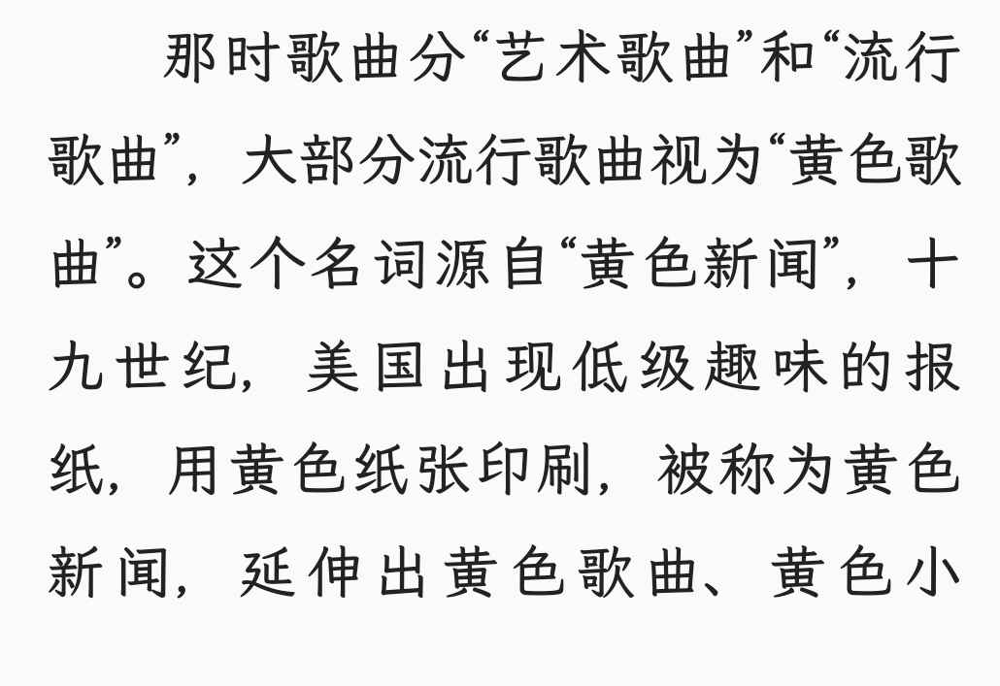

《关山夺路》记载「黄色音乐」的由来，大概现在所流行的各种「黄色］也是来源于此吧？

> 那时歌曲分“艺术歌曲”和“流行歌曲”，大部分流行歌曲视为“黄色歌曲”。这个名词源自“黄色新闻”，十九世纪，美国出现低级趣味的报纸，用黄色纸张印刷，被称为黄色新闻，延伸出黄色歌曲、黄色小说。黄色新闻传播色情，挑动情欲，那么黄色歌曲的含义不言而喻。甲方说，黄色歌曲就是靡靡之音，就是亡国之音，“乱世之征其词淫”，“亡国之音哀以思”，要不得。乙方说，“悲喜由心，非由乐也，将亡之政民心悲苦，故闻乐而悲。”并非亡国之音造成亡国，乃是国家快要亡了，亡国之音出现。丙方说，流行歌曲对上海人没问题，对“内地人”才有问题，所以问题不在歌，在听歌的人。丁方说，歌曲未唱之前，无所谓黄不黄，只有唱出来才有分别，任何一首歌都可能唱成黄色歌曲，即使国歌也在内。那一场争论真是“横看成岭侧看成峰”，使我“民智大开”。

